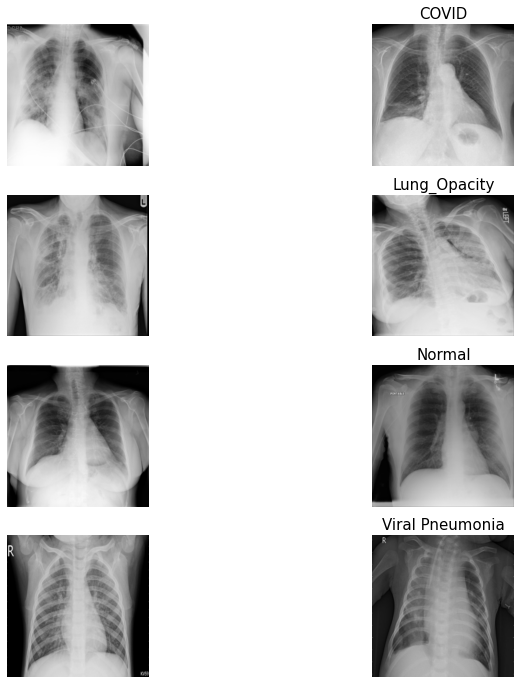

# Covid-19 Recognition using Chest X-ray Images
Covid-19 Recognition with Chest X-ray Images using ML and DL methods
<br />
Kaggle notebook: https://www.kaggle.com/code/thura1601/covid19-xray-w-ml-and-dl

## Introduction
This repository is a quick investigation of supervised machine learning algorithms on X-ray image data to detect Covid-19. Machine learning models like Naive Bayes, Support Vector Machines, Random Forest and XGBoost, and Deep learning algorithms like Multilayer perceptron and Convolutional neural networks were used. The dataset I used in this repository is also available online witn open-source access containing 21175 chest X-ray images of 4 classes - Normal , Covid, Opacity and Viral Pneumonia. Convolutional Neural Network (ConvNet) can be found that it outperformed other models in this study.

## Dataset
A team of researchers from Qatar University, Doha, Qatar, and the University of Dhaka, Bangladesh along with their collaborators from Pakistan and Malaysia in collaboration with medical doctors have created a database of chest X-ray images for COVID-19 positive cases along with Normal and Viral Pneumonia images. This COVID-19, normal, and other lung infection dataset is released in stages. 

- Dataset Link: https://www.kaggle.com/datasets/tawsifurrahman/covid19-radiography-database

The following Table is the description of the numbers of X-ray images per each class.

| Type | # of Images |
| --- | ---: |
|Normal | 10192|
|Covid | 3616|
|Opacity | 6012|
|Viral Pneumonia | 1345|
|**Total** |**21175** |

This figure shows two pictures per each class in the dataset.

 

Please cite these papers for the dataset

- M.E.H. Chowdhury, T. Rahman, A. Khandakar, R. Mazhar, M.A. Kadir, Z.B. Mahbub, K.R. Islam, M.S. Khan, A. Iqbal, N. Al-Emadi, M.B.I. Reaz, M. T. Islam, “Can AI help in screening Viral and COVID-19 pneumonia?” IEEE Access, Vol. 8, 2020, pp. 132665 - 132676.
- Rahman, T., Khandakar, A., Qiblawey, Y., Tahir, A., Kiranyaz, S., Kashem, S.B.A., Islam, M.T., Maadeed, S.A., Zughaier, S.M., Khan, M.S. and Chowdhury, M.E., 2020. Exploring the Effect of Image Enhancement Techniques on COVID-19 Detection using Chest X-ray Images.

## Implementation

- scikit-learn: used for training machine learning models
- tensorflow: used for training deep learning models
- opencv and pillow: used for image preprocessing
- pandas and numpy: used for tensor data processing

ConvNet architecture ...
- Categorical crossentropy
- Adam optimizer
- Epoches: 50
- Early stopping 

```
Model: "sequential_1"
_________________________________________________________________
Layer (type)                 Output Shape              Param #   
=================================================================
conv2d_6 (Conv2D)            (None, 64, 64, 32)        320       
_________________________________________________________________
conv2d_7 (Conv2D)            (None, 62, 62, 32)        9248      
_________________________________________________________________
max_pooling2d_3 (MaxPooling2 (None, 31, 31, 32)        0         
_________________________________________________________________
dropout_4 (Dropout)          (None, 31, 31, 32)        0         
_________________________________________________________________
conv2d_8 (Conv2D)            (None, 31, 31, 32)        9248      
_________________________________________________________________
conv2d_9 (Conv2D)            (None, 29, 29, 32)        9248      
_________________________________________________________________
max_pooling2d_4 (MaxPooling2 (None, 14, 14, 32)        0         
_________________________________________________________________
dropout_5 (Dropout)          (None, 14, 14, 32)        0         
_________________________________________________________________
conv2d_10 (Conv2D)           (None, 14, 14, 32)        9248      
_________________________________________________________________
conv2d_11 (Conv2D)           (None, 12, 12, 32)        9248      
_________________________________________________________________
max_pooling2d_5 (MaxPooling2 (None, 6, 6, 32)          0         
_________________________________________________________________
dropout_6 (Dropout)          (None, 6, 6, 32)          0         
_________________________________________________________________
conv2d_12 (Conv2D)           (None, 6, 6, 32)          9248      
_________________________________________________________________
conv2d_13 (Conv2D)           (None, 4, 4, 32)          9248      
_________________________________________________________________
max_pooling2d_6 (MaxPooling2 (None, 2, 2, 32)          0         
_________________________________________________________________
dropout_7 (Dropout)          (None, 2, 2, 32)          0         
_________________________________________________________________
flatten_1 (Flatten)          (None, 128)               0         
_________________________________________________________________
dropout_8 (Dropout)          (None, 128)               0         
_________________________________________________________________
dense_2 (Dense)              (None, 512)               66048     
_________________________________________________________________
dense_3 (Dense)              (None, 4)                 2052      
=================================================================
Total params: 133,156
Trainable params: 133,156
Non-trainable params: 0
```

## Evaluation

Although the accuracy was normally used to evaluate the classification models, other scores such as precision and recall are also quite important for disease detections especially with umbalanced data. Therefore, accuracy, precision and recall were used for the experiments.

| Model | Accuracy | Precision | Recall |
| --- | ---: | ---: | ---: |
| Naive Bayes | 0.56 | 0.63 | 0.56 |
| Support Vector Machine | 0.83 | 0.85 | 0.81 |
| Random Forest | 0.83 | 0.86 | 0.80 |
| XGBoost | 0.88 | 0.89 | 0.87 |
| Multilayer Perceptron | 0.77 | 0.76 | 0.75 |
| ConvNet | 0.92 | 0.92 | 0.92 |

## References
- Scikit-learn: Machine Learning in Python, Pedregosa et al., JMLR 12, pp. 2825-2830, 2011.
- TensorFlow: Large-scale machine learning on heterogeneous systems; Abadi et al., 2015. Software available from tensorflow.org.
- Thuseethan, S., Wimalasooriya, C., & Vasanthapriyan, S. (2022). Deep COVID-19 Recognition using Chest X-ray Images: A Comparative Analysis. ArXiv. https://doi.org/10.1109/SLAAI-ICAI54477.2021.9664727 
- https://towardsdatascience.com/how-precision-and-recall-affect-the-anti-covid-measures-38d625de61d9

## To do
- Training SOTA models
- Transfer learning with pretrained SOTA models
- Visual interpretation of the best model outputs
